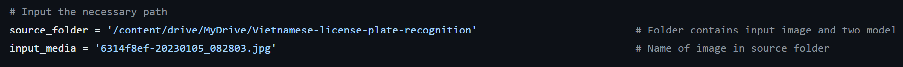

# **Vietnamese license plate recognition**
---
 Detect the Vietnamese license plate and recognize characters in plate using YOLOv8
## How to use
**Step 1 : Change the this folder's path corresponding to your computer path in line 9 of file ```inference.py```** 



**Step 2 : Choose the image which you want to predict and save it in folder ```Vietnamese-license-plate-recognition```**

**Step 3 : Coppy name of image or video in step 2 to change ```input_media``` in line 10 of file ```inference.py```** 

**Step 4 : Run ```inference.py``` and then you will see the results on screen or in ```results``` folder**
## Dataset
The dataset is used for training model in this project
[here](https://drive.google.com/file/d/1xOWRkpCgPEPAx1Tdc-tk39pgZixb7_ar/view?usp=drive_link)

This dataset is compiled from some original dataset:
- [license plates chars 2 Computer Vision Project](https://universe.roboflow.com/jakub-skibiski/license-plates-chars-2)
- [Vienamese Plate Dataset](https://github.com/winter2897/Real-time-Auto-License-Plate-Recognition-with-Jetson-Nano/blob/main/doc/dataset.md)
